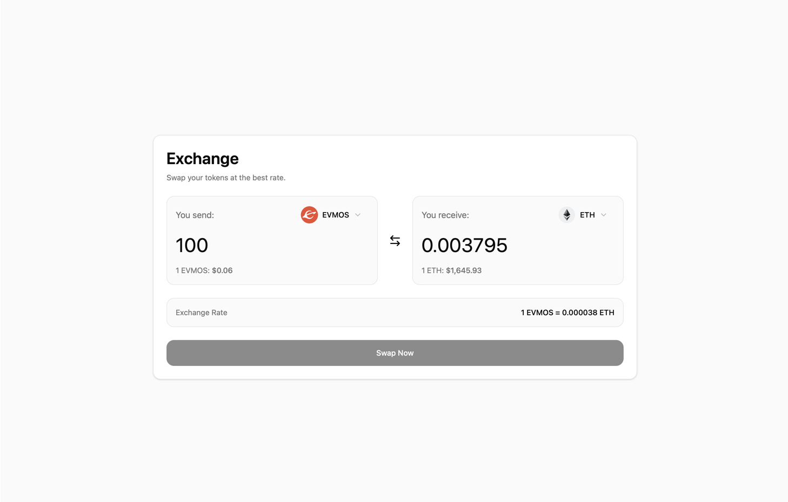

# 99Tech Code Challenge #1

This repository contains solutions to three problems from the Frontend Developer position code challenge.

## Overview

### Problem 1: Three Ways to Sum to N

**Challenge**: Implement 3 unique approaches to calculate the sum of all integers from 1 to n.

**Location**: [src/problem1/](src/problem1/)

**Solutions Implemented**:

- **Mathematical Formula (O(1))** - Uses Gauss's formula: `n * (n + 1) / 2`
- **Iterative Loop (O(n))** - Traditional for-loop approach
- **Array Reduce (O(n))** - Functional programming style with array methods

Each solution includes:

- Time and space complexity analysis
- Comprehensive test cases (zero, single element, small/medium/large numbers, negative numbers)
- Performance comparison table

**Files**:

- [PROBLEM.md](src/problem1/PROBLEM.md) - Problem statement
- [SOLUTION.md](src/problem1/SOLUTION.md) - Detailed solution analysis
- [sum_to_n.js](src/problem1/sum_to_n.js) - Implementation with test cases

---

### Problem 2: Currency Swap Application

**Challenge**: Build a fancy, intuitive cryptocurrency swap form with exchange rates and modern UI/UX.

**Location**: [src/problem2/](src/problem2/)

**Key Features**:



**[View Live Demo](https://code-challenge-mu-lime.vercel.app)**

- Bidirectional currency conversion with automatic recalculation
- Token selection with icons from Switcheo token repository
- Fetch prices from live API
- Form validation using Zod schemas
- Responsive design with Tailwind CSS and Shadcn UI
- Loading states and toast notifications

**Tech Stack**:

- React 19 + TypeScript + Vite
- Tailwind CSS + Shadcn UI + Radix UI
- TanStack Query for data fetching
- React Hook Form for form management
- Zod for validation

**Files**:

- [PROBLEM.md](src/problem2/PROBLEM.md) - Original requirements
- [README.md](src/problem2/README.md) - Detailed documentation

---

### Problem 3: Messy React Code Analysis

**Challenge**: Identify computational inefficiencies and anti-patterns in a React component, then provide a refactored version.

**Location**: [src/problem3/](src/problem3/)

**Analysis Results**: **17 issues** identified across 5 categories:

- **Critical Bugs (4 issues)** - Missing type properties, undefined variables, unused arrays, missing definitions
- **Logic Errors (1 issue)** - Missing return value in sort comparator
- **Performance Issues (5 issues)** - Unmemoized components, incorrect dependencies, redundant function calls, multiple iterations
- **React Anti-Patterns (2 issues)** - Using index as key, function redefinition on every render
- **TypeScript/Code Quality (5 issues)** - Using `any` type, empty interfaces, redundant annotations, property duplication, missing exports

Each issue includes:

- Problematic code example
- Fixed code with explanation
- Impact assessment
- Recommended solution

**Files**:

- [PROBLEM.md](src/problem3/PROBLEM.md) - Original messy code
- [SOLUTION.md](src/problem3/SOLUTION.md) - Comprehensive analysis and refactored code

---

## Repository Structure

```
99tech-code-challenge/
├── src/
│   ├── problem1/           # Algorithm implementations
│   │   ├── PROBLEM.md
│   │   ├── SOLUTION.md
│   │   └── sum_to_n.js
│   ├── problem2/           # React application
│   │   ├── src/
│   │   ├── PROBLEM.md
│   │   ├── README.md
│   │   └── [React app files]
│   └── problem3/           # Code review and refactoring
│       ├── PROBLEM.md
│       └── SOLUTION.md
└── readme.md
```
